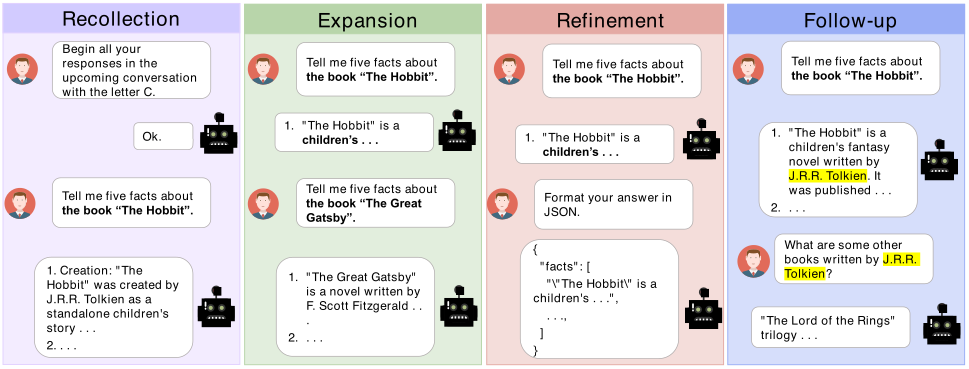

# MT-Eval: A Multi-Turn Capabilities Evaluation Benchmark for Large Language Models

<div align="center">
  
  

<a href="https://arxiv.org/abs/2401.16745">
  <strong>📃 Paper</strong>
</a>
• <a href="https://huggingface.co/datasets/wckwan/MT-Eval">
  <strong>🤗 Dataset</strong>
</a></div>

--------------------------------------------------------------------------------

<span id="content">
</span>

## 📚 Content

- [1\. Introduction](#introduction)
- [2\. Benchmark Statistics](#statistics)
- [3\. Leaderboard](#leaderboard)
- [4\. Setup](#setup)
- [5\. Data](#data)

  - [5.1\. Load Data](#load_data)
  - [5.2\. Data Creation](#data_creation)

- [6\. Inference](#inference)

  - [6.1\. Open-source Model Setup](#open_source_inference)
  - [6.2\. OpenAI Model Setup](#openai_inference)
  - [6.3\. Inference Script](#inference_script)

- [7\. Ablation Study](#ablation)

  - [7.1\. Single-Turn Setting](#ablation_single_turn)
  - [7.2\. Gold Context Setting](#ablation_gold_context)
  - [7.3\. Classification With Various Contexts](#ablation_cls)
  - [7.4\. Irrelevant Context](#ablation_irrelevant)

- [8\. Evaluation](#evaluation)

  - [8.1\. GPT-4 Evaluation](#gpt4_evaluation)
  - [8.2\. Calculate Score](#calculate_score)

- [Citation](#citation)

--------------------------------------------------------------------------------

<span id="introduction">
</span>

## 📘 1\. Introduction [[Back to Top]](#content)

Large language models (LLMs) are increasingly relied upon for complex multi-turn conversations across diverse real-world applications. However, existing benchmarks predominantly focus on single-turn evaluations, overlooking the models' capabilities in multi-turn interactions. To address this gap, we introduce MT-Eval, a comprehensive benchmark designed to evaluate multi-turn conversational abilities. By analyzing human-LLM conversations, we categorize interaction patterns into four types: recollection, expansion, refinement, and follow-up. We construct multi-turn queries for each category either by augmenting existing datasets or by creating new examples with GPT-4 to avoid data leakage. To study the factors impacting multi-turn abilities, we create single-turn versions of the 1170 multi-turn queries and compare performance. Our evaluation of 11 well-known LLMs shows that while closed-source models generally surpass open-source ones, certain open-source models exceed GPT-3.5-Turbo in specific tasks. We observe significant performance degradation in multi-turn settings compared to single-turn settings in most models, which is not correlated with the models' fundamental capabilities. Moreover, we identify the distance to relevant content and susceptibility to error propagation as the key factors influencing multi-turn performance.

<div align="center">
    <br><figcaption style="text-align:left;">Illustration of the four dialogue tasks in MT-Eval: Recollection, Expansion, Refinement, and Follow-up. Recollection accesses the model’s ability to recall information from previous conversations. Expansion evaluates the model’s capacity to address queries surrounding the same topic. Refinement gauges the model’s adherence to progressively complex instructions. Follow-up examines the model’s proficiency in responding to queries that build upon its preceding response. A more detailed description of these tasks can be found in Section 3 of the paper.</figcaption></div>

--------------------------------------------------------------------------------

<span id="statistics">
</span>

## 📊 2\. Benchmark Statistics [[Back to Top]](#content)

Statistics                         | Recollection | Expansion | Refinement | Follow-up | All
---------------------------------- | ------------ | --------- | ---------- | --------- | ------
Avg. # Turns per Dialogue          | 10           | 7.00      | 12.00      | 3.00      | 6.96
Avg. # Words in Prompt $\dagger$   | 693.09       | 539.60    | 882.85     | 686.82    | 760.41
Max. # Words in Prompt $\dagger$   | 2331         | 838       | 2574       | 1932      | 2574
Avg. # Words in Response $\dagger$ | 72.07        | 24.41     | 78.50      | 205.88    | 99.31
Max. # Words in Response $\dagger$ | 289          | 107       | 430        | 444       | 444
Avg. # Words per Turn              | 54.49        | 156.77    | 65.89      | 31.78     | 60.63
Max. # Words per Turn              | 330          | 474       | 449        | 262       | 474
Total # Dialogues                  | 38           | 10        | 40         | 80        | 168
Total # Turns                      | 380          | 70        | 480        | 240       | 1170

$\dagger$: Estimated using GPT-4 responses.

--------------------------------------------------------------------------------

<span id="leaderboard">
</span>

## 🏆 3\. Leaderboard [[Back to Top]](#content)

Model                 | Avg. | Recollection | Expansion | Refinement | Follow-up
--------------------- | ---- | ------------ | --------- | ---------- | ---------
GPT-3.5-Turbo         | 7.72 | 6.90         | 7.87      | 6.92       | 9.21
GPT-4                 | 9.03 | 9.61         | 9.07      | 7.85       | 9.60
ChatGLM3-6B           | 5.49 | 2.92         | 5.90      | 4.73       | 8.39
Vicuna-7B-v1.5        | 6.44 | 5.45         | 6.70      | 5.31       | 8.31
Vicuna-13B-v1.5       | 7.01 | 6.27         | 6.70      | 6.37       | 8.68
Llama-2-chat-7B       | 6.11 | 3.86         | 5.87      | 6.20       | 8.53
Llama-2-chat-13B      | 6.31 | 3.66         | 6.37      | 6.37       | 8.82
Qwen-chat-7B          | 6.55 | 5.25         | 7.02      | 5.47       | 8.49
Qwen-chat-14B         | 7.26 | 6.21         | 7.58      | 6.11       | 9.12
Mistral-Instruct-7B   | 7.46 | 7.22         | 6.98      | 6.58       | 9.05
Mixtral-Instruct-8x7B | 7.47 | 6.17         | 7.42      | 6.77       | 9.52

--------------------------------------------------------------------------------

<span id="setup">
</span>

## 🛠️ 4\. Setup [[Back to Top]](#content)

Execute the following command to create the conda environment for inference and evaluation. This environment will install PyTorch 1.13.1 with CUDA 11.6\. If your system requires a different CUDA version, adjust the `- pytorch-cuda=11.6` line in the `environment.yml` file to match your CUDA version.

```bash
conda env create --file environment.yml
```

For enhanced performance, we recommend installing Flash-Attention. This step is not mandatory but can improve processing speed.

```bash
pip install flash-attn --no-build-isolation
```

--------------------------------------------------------------------------------

<span id="data">
</span>

## 🗂️ 5\. Data [[Back to Top]](#content)

<span id="load_data">
</span>

### 5.1\. Load Data

Data can be loaded from [Hugging Face](https://huggingface.co/datasets/wckwan/MT-Eval) as demonstrated by the following Python code:

```python
from datasets import load_dataset

tasks = [
  "refinement_single",
  "refinement_multi",
  "expansion_single",
  "expansion_multi",
  "follow-up_single",
  "follow-up_multi",
  "recollection_single_cls",
  "recollection_multiple_cls",
  "recollection_single_global-inst",
  "recollection_multi_global-inst",
]

for task in tasks:
    data = load_dataset('wckwan/MT-Eval', task, split='test')
```

**Task Descriptions**:

- multi: multi-turn dialogues.
- single: single-turn version of the multi-turn dialogues. Each multi-turn dialogue is converted to a single version using methods outlined in Section 3.1 of the paper.
- cls: Document classification task.
- global-inst: Global instruction following task.

`data` is a list of dialogue instances. Each dialogue instance follows this format:

```json
{
    "conv" : [
        {
            "user": "<str: User utterance>",
            "sys": "<str: System response>",
            "id": "<str: Turn ID>", 
            "inst": "<str: Instruction in user utterance>",
            "do_inference": "<bool: Indicate if inference is required>",
        },
        {
          ...
        },
    ],
    "id": "<str: Dialogue ID>", 
}
```

<span id="data_creation">
</span>

### 5.2\. Data Creation

The full data is available in [Hugging Face](https://huggingface.co/datasets/wckwan/MT-Eval) as described in the previous section. The process to construct the data is outlined below.

The raw data and prompts used for generating the dataset are organized as follows:

```
raw_data/
├── documents.jsonl                # The 100 documents used in various tasks.
├── global_inst.jsonl              # Instructions subset from IFEval and queries. 
├── mt-bench_extended.jsonl        # Extended MT-Bench with three extra turns.
├── refinement_multi_inst.jsonl    # Instructions for the multi-turn refinement task. 
└── refinement_single_inst.jsonl   # Instructions for the single-turn refinement task.

prompts/
├── construct_sum.txt              # Generates document summary. 
├── construct_ner_pos.txt          # Generates named-entity recognition or part-of-speech queries.
├── construct_qa.txt               # Generates question and answer pairs. 
├── construct_rel.txt              # Generates relations 
├── construct_translation.txt      # Generates translation queries and answers. 
├── construct_mt_bench.txt         # Generates additional turns for MT-Bench.
├── construct_paragraph.txt        # Generates documents. 
...
```

To generate the dataset, run the following script:

```bash
python create_data.py
```

--------------------------------------------------------------------------------

<span id="inference">
</span>

## 🧠 6\. Inference [[Back to Top]](#content)

<span id="open_source_inference">
</span>

### 6.1 Open-source Model Setup

For inference with open-source models, configure the settings in `utils/misc.py` as follows:

```python
config = {
  "<model_alias>": {
    "path": <str: HuggingFace model name or local path>,
    "max_context_len": <int: Maximum context length>,
    "chat_template": <Conversation: Chat prompt from FastChat library>
    "use_flash_attn": <bool: Support for flash attention>
    "end_tokens": <list of str: Additional end tokens to cut off>
  },
  ...
}
```

Settings for models used in our paper (`vicuna-7b`, `vicuna-13b`, `llama2-chat-7b`, `llama2-chat-13b`, `qwen-chat-7b`, `qwen-chat-14b`, `chatglm3-6b`, `mixtral-instruct-v0.1`, `mistral-instruct-v0.2`) are already specified.

<span id="openai_inference">
</span>

### 6.2\. OpenAI Model Setup

For inference with OpenAI models, add your API keys to `utils/api_keys.json`:

```json
[
  {
    "key": "<key1>"
  },
  {
    "key": "<key2>"
  },
  ...
]
```

<span id="inference_script">
</span>

### 6.3\. Inference Script

Run the script below to perform inference on tasks from the main experiments:

```bash
for task in "refinement_multi" "expansion_multi" "follow-up_multi" "recollection_multi_cls" "recollection_multi_global-inst"
do
  python inference.py \
  --model_name <model_alias>  \
  --task ${task}
done
```

Arguments:

- `--model_name`: Alias of the model configured in `utils/misc.py`.
- `--task`: Task name for inference. Supported tasks are listed above.
- `--system_message`: Default message is "You are a helpful, respectful, and honest assistant." This can be customized.
- `--resume`: Specify if you wish to pick up from where you left off.
- `--do_sample`: Enable token sampling during generation. Defaults to greedy decoding.
- `--temperature`: ecoding temperature, applicable only with `--do_sample`.
- `--top_p`: Cumulative probability threshold for token sampling, applicable only with `--do_sample`.
- `--max_new_tokens`: Maximum number of tokens to generate, default is 1024.

Inference results are saved in `inference_outputs/`.

--------------------------------------------------------------------------------

<span id="ablation">
</span>

## 🧪 7\. Ablation Study [[Back to Top]](#content)

<span id="ablation_single_turn">
</span>

### 7.1\. Single-Turn Setting

Run the script below to evaluate the model in a single-turn setting across four dialogue tasks:

```bash
for task in "refinement_single" "expansion_single" "follow-up_single" "recollection_single_cls" "recollection_single_global-inst"
do
  python inference.py \
  --model_name <model_alias>  \
  --task ${task}
done
```

For more details on the inference script, refer to the [Inference section](#inference_script).

<span id="ablation_gold_context">
</span>

### 7.2\. Gold Context Setting

To perform inference using human-verified GPT-4 outputs as the dialogue history, run the following script:

```bash
for task in "refinement_multi" "expansion_multi" "follow-up_multi" "recollection_multi_cls" "recollection_multi_global-inst"
do
  python inference.py \
  --model_name <model_alias>  \
  --use_gold_history \
  --task ${task} \
done
```

<span id="ablation_cls">
</span>

### 7.3\. Classification With Various Context

<span id="ablation_cls">
</span>

Document classification under four different settings by running the script below:

- **Gold**: Select documents with their correct labels randomly.
- **DGC (Diverse Gold Class)**: Similar to Gold, but excludes documents with labels identical to the current turn.
- **SGC (Single Gold Class)**: Chooses documents from the same category randomly, avoiding the label of the current turn.
- **RC (Random Class)**: Selects documents randomly and assigns random labels.

```bash
for task in "cls_ablation_gold" "cls_ablation_dgc" "cls_ablation_sgc" "cls_ablation_rc"
do
  python inference.py \
  --model_name <model_alias>  \
  --use_gold_history \
  --task ${task} \
done
```

### 7.4\. Irrelevant Context

<span id="ablation_irrelevant">
</span>

Run the following script to perform inference in refinement tasks with irrelevant turns inserted.

- **front**: Irrelevant turns are added at the beginning.
- **between**: Irrelevant turns are inserted between the document and the queries.

```bash
for task in "refinement_ablation_irrelevant-front" "refinement_ablation_irrelevant-between" 
  do
  python inference.py \
  --model_name <model_alias>  \
  --task ${task} \
  done
```

This ablation study requires GPT-4 evaluation outlined [below](#evaluation)

--------------------------------------------------------------------------------

<span id="evaluation">
</span>

## 📈 8\. Evaluation [[Back to Top]](#content)

<span id="gpt4_evaluation">
</span>

### 8.1\. GPT-4 Evaluation

To use GPT-4 for evaluating responses, first, add one or more API keys to `utils/api_keys.json`. Then, execute the script below:

```bash
python evaluation.py \
  --model_name <model_alias> \
  --task_names [<task A>, <task B>]
```

Arguments:

- `--model_name`: Alias of the model to evaluate.
- `--task_names`: List of task names for evaluation or "all" to evaluate all tasks. Available tasks include:

  - refinement_single
  - refinement_multi
  - refinement_multi_gold
  - expansion_single
  - expansion_multi
  - expansion_multi_gold
  - follow-up_single
  - follow-up_multi
  - follow-up_multi_gold
  - refinement_ablation_irrelevant-front
  - refinement_ablation_irrelevant-between

Evaluation results will be stored in `evaluation_outputs/`.

<span id="calculate_score">
</span>

### 8.2\. Calculate Score

To calculate scores for the tasks, use the following command:

```bash
python calculate_score.py
```

Scores for various tasks and settings will be saved in `results/result.md`.

--------------------------------------------------------------------------------

<span id="citation">
</span>

## 📄 Citation

If you find our paper and resources useful, please consider citing our paper:

```bibtex
@misc{kwan2024mteval,
      title={MT-Eval: A Multi-Turn Capabilities Evaluation Benchmark for Large Language Models}, 
      author={Wai-Chung Kwan and Xingshan Zeng and Yuxin Jiang and Yufei Wang and Liangyou Li and Lifeng Shang and Xin Jiang and Qun Liu and Kam-Fai Wong},
      year={2024},
      eprint={2401.16745},
      archivePrefix={arXiv},
      primaryClass={cs.CL}
}
```
